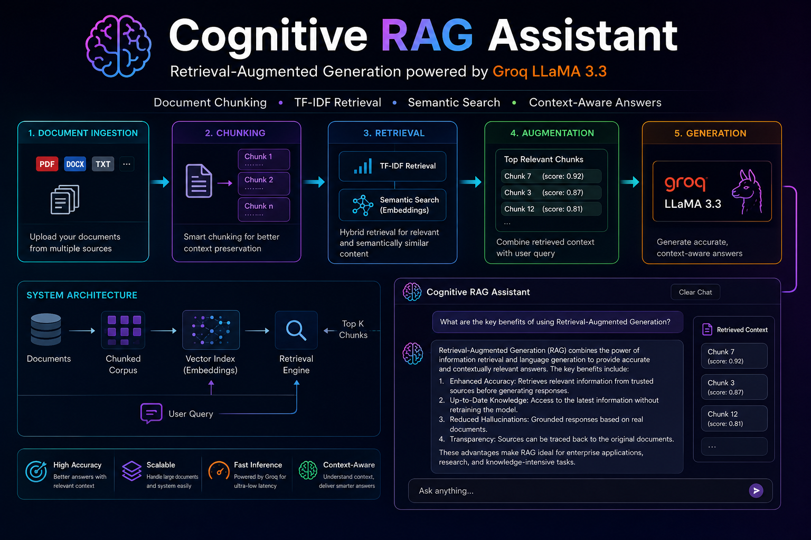
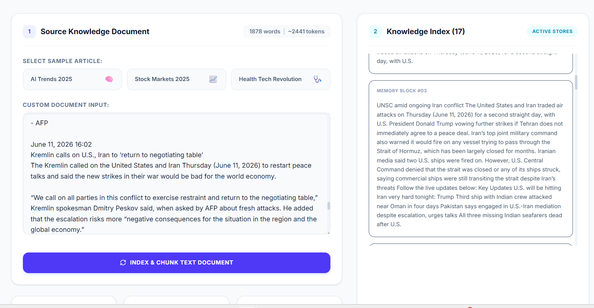
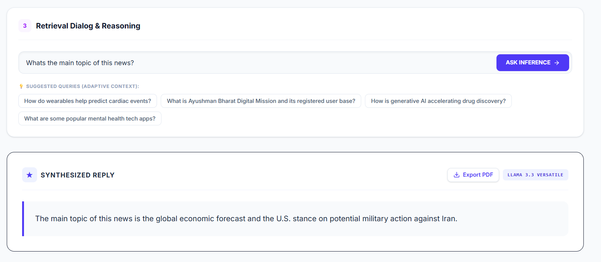

# 🧠 Cognitive RAG Assistant

<p align="center">
  
</p>

<p align="center">
  <strong>AI-Powered Retrieval-Augmented Generation (RAG) Knowledge Assistant</strong>
</p>

<p align="center">
  Document Chunking • TF-IDF Retrieval • Cosine Similarity Search • Groq LLaMA 3.3
</p>

---

## 📖 Overview

Cognitive RAG Assistant is a modern Retrieval-Augmented Generation (RAG) system that allows users to upload or paste documents, automatically index and chunk content, retrieve the most relevant information using TF-IDF and cosine similarity, and generate contextual answers powered by Groq's LLaMA 3.3 model.

Unlike traditional chatbots that rely solely on pre-trained knowledge, this system grounds every response in the provided document, ensuring accurate and context-aware answers.

---

## ✨ Features

### 📄 Document Processing

* Smart document chunking
* Automatic text segmentation
* Context preservation through chunk overlap
* Real-time indexing pipeline

### 🔍 Retrieval Engine

* TF-IDF based ranking
* Cosine similarity scoring
* Top-K chunk retrieval
* Highlighted source chunks

### 🤖 AI-Powered Responses

* Groq LLaMA 3.3 integration
* Context-aware answer generation
* Hallucination reduction
* Source-grounded responses

### 📊 Interactive Visualization

* Retrieval pipeline monitoring
* Chunk activation indicators
* Similarity score tracking
* Document statistics dashboard

### 📥 Export Support

* Generate professional PDF reports
* Export answers instantly
* Query history preservation

### 🎨 Modern User Experience

* Fully responsive interface
* Smooth animations with Motion
* Clean professional dashboard
* Interactive retrieval workflow

---

## 🏗️ System Architecture

```text
Document Input
      │
      ▼
Document Chunking
      │
      ▼
TF-IDF Vectorization
      │
      ▼
Cosine Similarity Search
      │
      ▼
Top Relevant Chunks
      │
      ▼
Groq LLaMA 3.3
      │
      ▼
Generated Answer
```

---

## 🛠️ Tech Stack

### Frontend

* React
* TypeScript
* Vite
* Tailwind CSS
* Motion
* Lucide Icons

### Retrieval Layer

* TF-IDF
* Cosine Similarity
* Custom Chunking Engine

### AI Backend

* Groq API
* LLaMA 3.3 70B Versatile

### Utilities

* jsPDF
* dotenv

---

## 🚀 Getting Started

### Clone Repository

```bash
git clone https://github.com/yourusername/cognitive-rag-assistant.git

cd cognitive-rag-assistant
```

### Install Dependencies

```bash
npm install
```

### Configure Environment Variables

Create a `.env` file:

```env
GROQ_API_KEY=your_groq_api_key_here
```

### Start Development Server

```bash
npm start
```

---

## 📸 Screenshots

### Document Indexing



### Retrieval Visualization and Generated Response



---

## 🎯 Example Questions

### AI Trends Dataset

* What is Agentic AI?
* What companies launched AI agents?
* What is the IndiaAI Mission?
* What is the EU AI Act?

### Market Dataset

* What companies form the Magnificent Seven?
* Why did NVIDIA cross $3 trillion market cap?
* What caused Bitcoin's surge?

### Health Dataset

* How are wearables used in healthcare?
* What is the Ayushman Bharat Digital Mission?
* How is AI accelerating drug discovery?

---

## 🔬 Learning Objectives

This project demonstrates:

* Retrieval-Augmented Generation (RAG)
* Information Retrieval
* Natural Language Processing
* Context Engineering
* Large Language Model Integration
* Vector Search Fundamentals
* Full-Stack AI Application Development

---

## 🤝 Contributions

Contributions, feature suggestions, and improvements are welcome.

If you'd like to improve the retrieval engine, UI/UX, model integration, or documentation, feel free to open an issue or submit a pull request.

---

## ⭐ Support

If you found this project useful, consider giving it a star ⭐ and sharing it with others interested in AI, NLP, and Retrieval-Augmented Generation systems.

---

## 👨‍💻 Author

**Supreet Mohapatra**

Building intelligent systems, AI-powered applications, and real-world machine learning projects.
